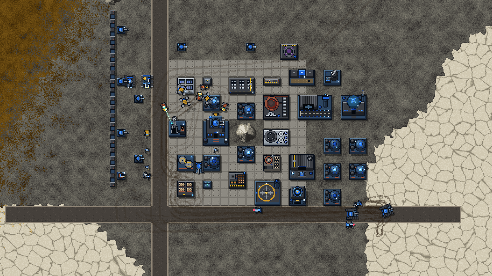
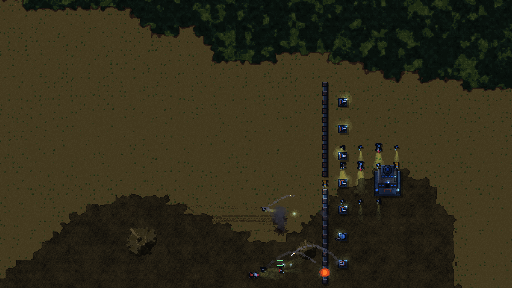
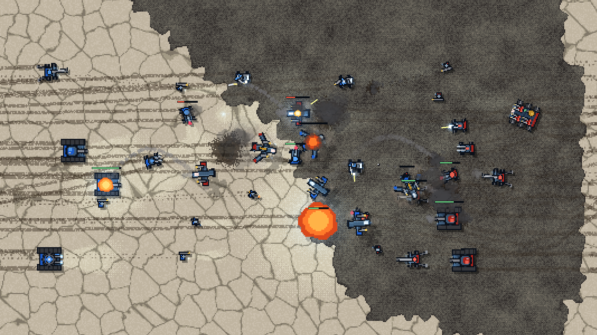
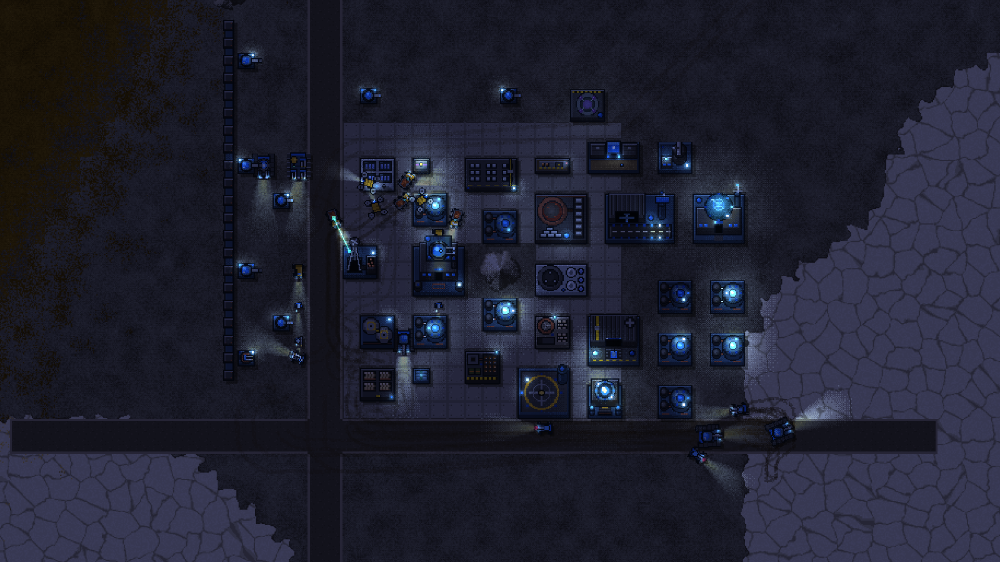
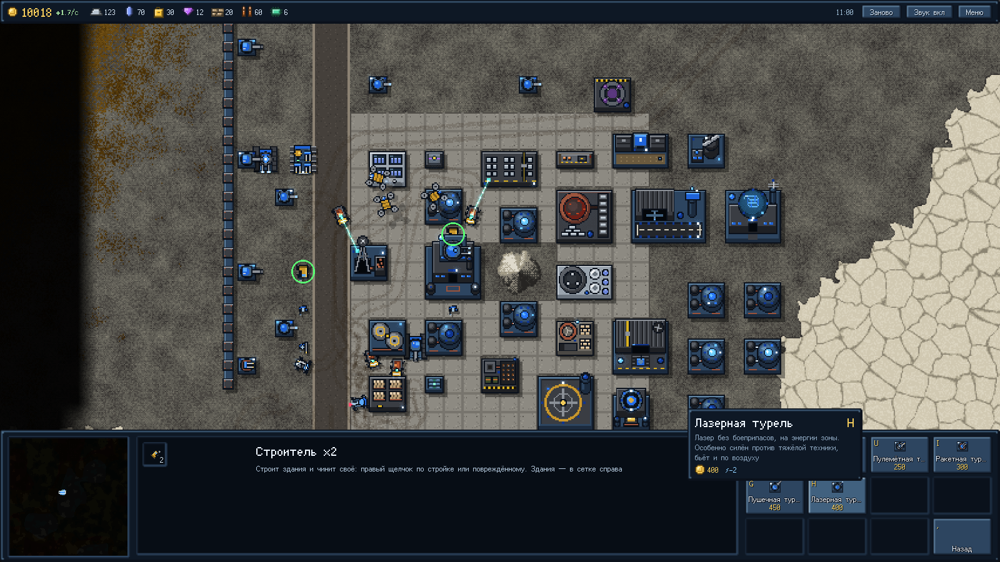

# Kharos

Многопользовательская браузерная RTS в духе Rusted Warfare и Rust. Игрок начинает не с готовой базы, а с машины-основателя (MCV) и пары строителей. Дальше он разворачивает поселение на процедурной карте, добывает и перерабатывает руду, налаживает грузовую логистику и защищает базу.



## Что уже есть

- **Процедурная карта.** Бесконечная, считается из сида. Четыре биома: эрг, солончаки, красные пустоши и топи. Местность влияет на игру: строят только на скале, песок и болото замедляют технику, а горы непроходимы.
- **Пиксель-арт без ассетов.** Местность рисует один GLSL-шейдер, а здания и юниты собираются из векторных чертежей в коде.
- **Погода и время суток.** Пыль, дождь, снег, ветер, ночь, а ещё огни зданий и фары.
- **Экономика.** Шахты дают руду, её перерабатывают в ресурсы, а из ресурсов собирают изделия. Грузовики сами развозят грузы по заявкам, а космопорт продаёт их за кредиты.
- **Бой.** Восемь боевых юнитов в четырёх классах, у каждого есть контр-юниты. Ещё есть стены и турели на боеприпасах, а также туман войны.
- **Сеть.** Хост ведёт симуляцию и шлёт каждому игроку только то, что тот видит. Одиночная игра идёт через тот же хост, только в воркере.

| | |
| --- | --- |
|  |  |
|  |  |

## Запуск

```bash
npm install
npm run dev      # клиент: http://localhost:5173
npm run server   # пробный сервер для сетевой игры, ws://localhost:8787
bun test         # тесты
```

## Сервер

Готовые сборки лежат в [релизах](https://github.com/vicimpa/kharos/releases/latest). Свежая сборка из `main` скачивается напрямую:

- [Linux x64](https://github.com/vicimpa/kharos/releases/latest/download/kharos-server-linux-x64) и [Linux arm64](https://github.com/vicimpa/kharos/releases/latest/download/kharos-server-linux-arm64): Bun для них не нужен.
- [main.js](https://github.com/vicimpa/kharos/releases/latest/download/main.js): для машины, где стоит Bun.

```bash
curl -LO https://github.com/vicimpa/kharos/releases/latest/download/kharos-server-linux-x64
chmod +x kharos-server-linux-x64
PORT=8787 ./kharos-server-linux-x64
```

Настройки сервер берёт из `settings.json` рядом с собой. Если файла нет, при первом запуске он записывается со всеми параметрами по умолчанию:

- `port`: порт сервера;
- `password`: пароль на вход. Пустой — заходит кто угодно. Игрок вводит пароль в «Сетевой игре», и браузер запоминает его для этого адреса;
- `save`: имя файла сохранения;
- `size`, `fog`, `generator`, `weather`: размер карты, туман войны, генерация и погода. Действуют только на новый мир;
- `rules`: правила игры. Применяются и к миру из сохранения, так что их можно менять между запусками.

Неизвестные параметры и значения не того типа сервер пропускает и пишет об этом в консоль. Переменные окружения `PORT`, `SAVE` и `SETTINGS` (путь к файлу настроек) сильнее файла.

Мир сохраняется раз в 30 секунд и при остановке, а при запуске сервер продолжает с него. Игроки после перезапуска возвращаются к своим базам. Сохранение другой версии игры сервер откладывает в `<имя>.v<версия>` и начинает мир заново. Чтобы начать новый мир, удалите файл сохранения или укажите в `save` другое имя.

### wss

Клиент с GitHub Pages открыт по https, и браузер не даст ему подключиться к `ws://`, только к `wss://`. За это отвечает блок `tls` в `settings.json`:

- `"mode": "auto"`: сервер сам получает сертификат Let's Encrypt и продлевает его за 30 дней до конца срока. Домен берётся из `domain`. Если он пустой, сервер узнаёт свой внешний IP и берёт имя [sslip.io](https://sslip.io): для `1.2.3.4` это `1-2-3-4.sslip.io`, и адрес в игре будет `wss://1-2-3-4.sslip.io:8787`. Let's Encrypt проверяет домен по порту 80, поэтому он должен быть свободен и открыт снаружи (`challengePort`, если 80 проброшен на другой порт). `email` можно указать для писем от Let's Encrypt, `staging: true` выпускает тестовый недоверенный сертификат без лимитов. Ключи и сертификат лежат в папке `dir`;
- `"mode": "files"`: свои сертификат и ключ в PEM, пути в `cert` и `key`. Сервер перечитывает их раз в 12 часов;
- `"mode": "off"`: обычный `ws://`.

Bun не умеет менять сертификат у работающего сервера, поэтому после продления сервер переоткрывает порт, и игроки на миг отключаются.

## Стек

TypeScript, Vite, Preact, собственный ECS и собственный рендер на WebGL 2. Сервер работает на Bun.

## Документация

- [Подробное описание](docs/overview.md): что работает, управление, структура кода, замысел игры.
- [Игровой процесс и баланс](docs/gameplay.md).
- [Дизайн и план работ](docs/design.md).
